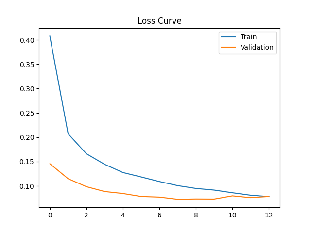
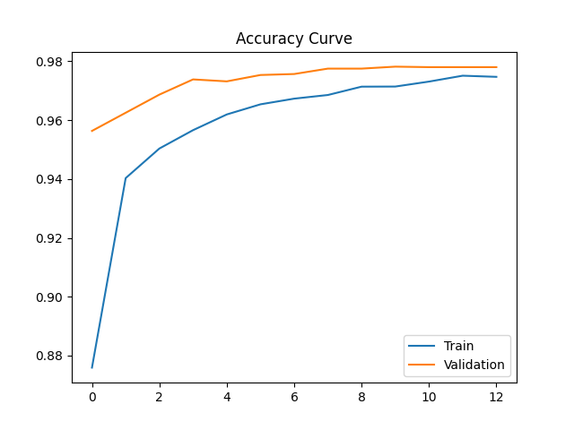
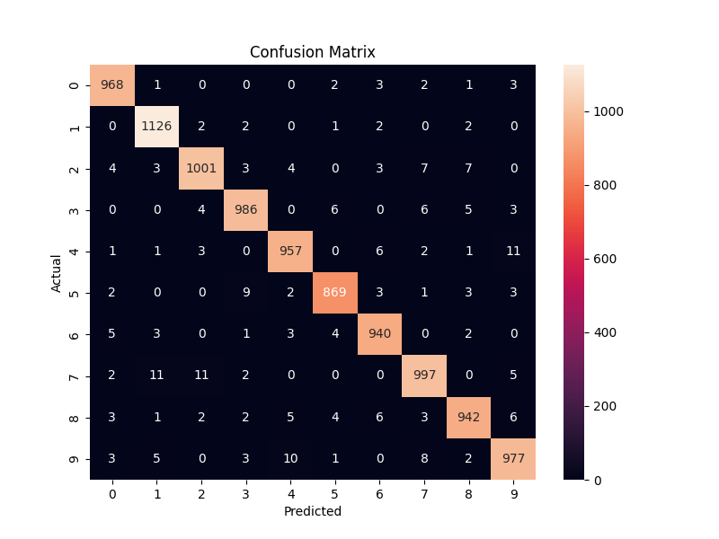

# Feedforward Neural Network for MNIST Digit Classification

## 1. Overview
This project implements a **Feedforward Neural Network (FNN)** to classify handwritten digits (0–9) using the **MNIST dataset**.  
The model is built using TensorFlow/Keras and follows a complete machine learning pipeline: preprocessing, training, evaluation, and visualization.

---

## 2. Objective
- Build a multi-layer feedforward neural network  
- Train it on image data (MNIST)  
- Evaluate using standard classification metrics  
- Visualize learning behavior  

---

## 3. Dataset
**MNIST Dataset**
- 70,000 grayscale images  
- Image size: 28 × 28  
- 10 classes (digits 0–9)  

Each image is converted into a numerical vector of size **784** for input into the FNN.

---

## 4. Project Structure

| Folder / File | Purpose |
|--------------|--------|
|`fnn_mnist_model.h5/`| Saved trained model weights|
| `outputs` | Saved predictions, evaluation results, loss_curve |
| `src/models.py` |Neural network architecture definition |
| `src/preprocess.py` | Data loading, normalization, encoding |
| `src/train.py` | Model training and Early stopping |
| `src/evaluate.py`|Model evaluation and metrics calculation |
| `src/utils.py`| Plotting loss/accuracy curves and utilities |
| `main.py` | Entry point to run full pipeline |
| `README.md` | Project documentation |
| `.gitignore` | Ignore datasets, models, cache |

---

## 5. Workflow

### 1. Data Preprocessing
- Load MNIST dataset  
- Normalize pixel values (0–255 → 0–1)  
- Split into train, validation, and test sets  
- Apply one-hot encoding  

### 2. Model Building
- Flatten input (28×28 → 784)  
- Two hidden layers with ReLU activation  
- Dropout for regularization  
- Softmax output layer  

### 3. Training
- Optimizer: Adam  
- Loss: Categorical Crossentropy  
- Early stopping based on validation loss  

### 4. Evaluation
- Accuracy  
- Precision, Recall, F1-score  
- Confusion Matrix  

### 5. Visualization
- Loss curve  
- Accuracy curve  
- Confusion matrix heatmap  

---

## 6. Model Architecture
Input (784)
↓
Dense (128, ReLU)
↓
Dropout (0.3)
↓
Dense (64, ReLU)
↓
Dropout (0.3)
↓
Dense (10, Softmax)

---

## 7. Results
- Accuracy: ~97–98%  
- Stable training and validation curves  
- Minimal overfitting observed
## Results Visualization

### Loss Curve

### Accuracy Curve

### Confusion Matrix

---

## 8. Output Files
After running the project:
|-----------|---------------|

| `outputs/` | loss_curve.png, accuracy_curve.png, confusion_matrix.png |

---

## 9. Key Concepts Used
- Feedforward Neural Networks  
- Activation functions (ReLU, Softmax)  
- Backpropagation  
- Gradient-based optimization (Adam)  
- Regularization (Dropout)  
- Early stopping  

---

## 10. Limitations
- FNN does not capture spatial relationships in images  
- Convolutional Neural Networks (CNNs) perform better on image tasks  

---

## 11. Future Improvements
- Implement CNN for higher accuracy  
- Add learning rate scheduling  
- Perform hyperparameter tuning  
- Visualize misclassified samples  

---

## 12. Conclusion
This project demonstrates how a Feedforward Neural Network can effectively classify image data by converting it into numerical vectors.  
Despite its simplicity, the model achieves high accuracy and provides a strong baseline for image classification tasks.

---

## 15. Author
- Name:   
- Course: B.Tech CSE  
- Project: Feedforward Neural Network Implementation  
